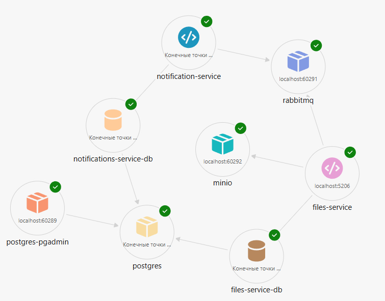

# 🌥️ CloudStorage
Проект представляет собой облачное хранилище файлов.
Реализована базовый API для загрузки, скачивания и удаления файлов.

## Цель проекта
Цель проекта - это расширение моих компетенций путем изучения микросервисной архитектуры на практике.
Здесь я хочу набить шишки, применить паттерны отказоустойчивой масштабируемой архитектуры и применить ряд новых технологий
на практике.

## Что достигнуто?
- Внедрены Transactional Inbox/Outbox паттерны для надежности коммуникации через EventBus
- Выделены границы микросервисов, идет их активная разработка
- Инфраструктура развернута с помощью Aspire
- Реализованы FileService, NotificationService
- Аутентификация с помощью KeyCloak
---

## Технологии
- **Aspire**: Оркестрация, логирование, мониторинг зависимостей.
- **RabbitMQ**: message-broker для асинхронной коммуникации
- **MinIO**: S3-совместимое хранилище объектов
- **AWSSDK**: SDK для работы с S3-совместимыми хранилищами
- **PostgreSQL**: реляционная база данных
- **StronglyTypedId**: экспериментальная библиотека для избавления от primitives obsession

---

## Цели
Данный проект находится в разработке, но у меня на него большие планы. Конкретно:
- **Blazor**: Написать frontend, используя Blazor
- **NotificationService**: Закончить работу над *NotificationService*, подключить *MailHog* для тестирования
- **AWScannerService**: Закончить работу над *AWScannerService*, доработав интеграцию с *VirusTotal*(в отдельной ветке)
- **UserService**: Разработать *UserService*, разобраться с OpenID Connect и интегрироваться с *KeyCloak*
- **gRPC**: Перевести все общение между микросервисами на *gRPC*

---

## Требования
- [.NET 9 SDK](https://dotnet.microsoft.com/download/dotnet/9.0)
- [Docker](https://www.docker.com) или Podman
- IDE (VS 2022+, Rider, VS Code)
